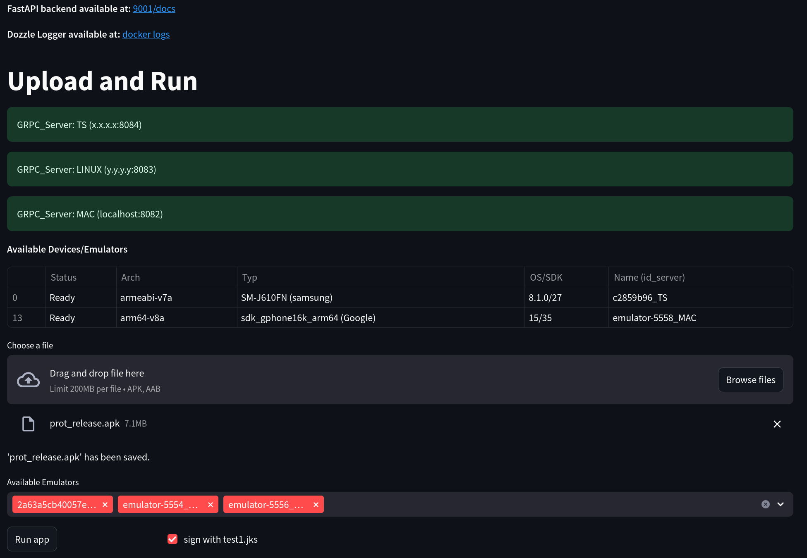
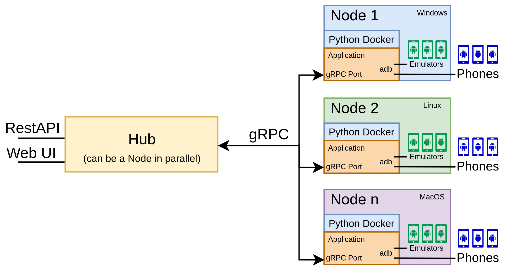
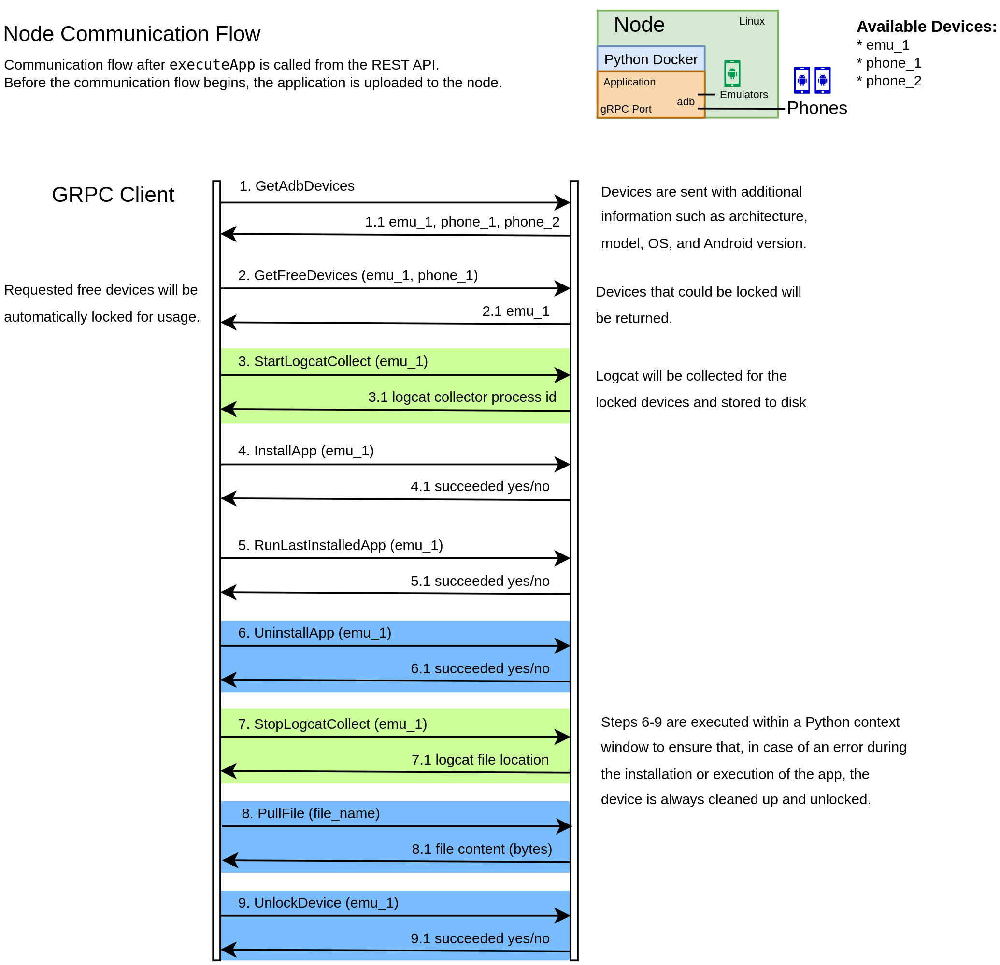

# Scalable Mobile TestStation Architecture & Infrastructure

In software development, comprehensive testing is curcial. For mobile, a wide variety of devices and emulators is needed to ensure the developed application is compatible and functions flawlessly on as many platforms and devices as possible.

The **Mobile TestStation** addresses this need by providing a scalable, distributed infrastructure for automated testing of Android applications. This system enables developers to test their applications across a diverse range of devices - from physical Android phones to various emulators running on different host systems. The Mobile TestStation's architecture allows for seamless integration of new devices and test nodes, making it ideal for continuous integration pipelines and large-scale testing scenarios. This post delves into the technical implementation details of our Mobile TestStation, which we've successfully used to automate testing of mobile application across different devices and environments.

At this stage, the Mobile TestStation supports Android devices exclusively.



Fig.: Streamlit based Web UI, showing the deployed Mobile TestStation. Note that test devices have
been removed in the image to keep the image small.

## Architecture
The Mobile TestStation follows a distributed architecture centered around two key components: the TestStation Hub and TestStation Nodes. The Hub serves as the central orchestrator, providing both a REST API through [FastAPI](https://fastapi.tiangolo.com/) and an interactive web interface via [Streamlit](https://streamlit.io/). It maintains connections to multiple TestStation Nodes, each responsible for managing a set of physical and/or virtual Android devices. This design enables flexible deployment scenarios - for instance, a Node could run on a Windows machine hosting [NOX](https://www.bignox.com/) emulators, while another Node operates on an ARM-based Mac running Arm64 Android Studio emulators. The Hub abstracts away the underlying device locations, allowing users to interact with any device through a unified interface regardless of its physical location or hosting environment.
Each TestStation Node implements a gRPC server that maintains an internal state of its connected devices, handling device discovery, locking mechanisms, and ADB command execution. The Node's state management ensures that devices can only be used by one user at a time, preventing potential conflicts that could arise from concurrent installations or operations. When a user requests device access through the Hub, the request is routed to the appropriate Node, which then handles device locking, app installation, execution, and log collection.



Fig.: Diagram of the Mobile TestStation architecture, illustrating Hub and Nodes.

### Node
The TestStation Node is available via a gRPC interface and maintains an internal state of all connected devices. A device can only be used by one user at a time, as parallel usage is not supported due to the risk of concurrent installations of the same application. Before a device can be used, it needs to be locked, and once approved, it can be used freely until unlocked.
A key advantage of the Node architecture is its ability to run on different host systems, each offering unique benefits for Android emulation. This is especially important to increase test coverage as emulators behave differently across hosts. While the Docker-based Node approach ensures a defined interface, the advantages of different hosts can still be used.



Fig.: Node communication flow when executing an application on a Node.

## Automatic App Execution
The Mobile TestStation implements automated app execution through a well-defined workflow orchestrated by the Hub and executed by the Nodes. The process begins with the REST API endpoint `executeApp`, which accepts an APK/AAB file and execution parameters. The implementation follows these technical steps:

1. File Distribution
    - The Hub receives the app file through REST API/UI's UploadFile interface
    - File validation ensures only .apk or .aab formats are accepted
    - The file is distributed to the appropriate Nodes based on device selection
    - For AAB files, automatic conversion to APK is performed using the Android Bundle Tool
    - If the specified APK files are signed, AAB files are signed automatically during conversion to APK

2. Device Preparation
    - Each Node performs a package name check using `adb shell pm list packages`
    - If the package exists, it's uninstalled using `adb uninstall <package_name>`
    - The device is prepared for a clean installation state
    - Start logcat collection

3. Installation Process
    - APK signing is performed if requested, using the configured keystore
    - Installation is executed via `adb install -r <apk_path>`

4. Execution Control
    - App launch is initiated using `adb shell monkey -p <package_name> -c android.intent.category.LAUNCHER 1`
      - See the executeApp API on how to specify a custom command for your app execution, e.g. to pass additional parameters to the app.
    - Execution time is controlled through a configurable timer

5. Cleanup and Log Collection
    - After the specified execution time, the app is terminated using `adb shell am force-stop <package_name>`
    - Deinstallation of the application
    - Logcat collection is stopped and saved

The collected logcat output is sent to the Hub and returned to the user for further analysis. The evaluation is left to the user as different devices and Android versions
can have a slightly different logcat format.


## Dockerized Environment
To ensure a consistent and reproducible runtime environment across different host systems, we chose Docker for deploying both the Hub and Node services. Docker’s containerized approach provides an isolated and standardized execution environment, this makes it easy for the Java based signing tool (apksigner) and the [Android SDK commandline tools](https://developer.android.com/studio#command-tools) to behave consistently.

The Node containers run in host network mode on Linux, which simplifies access to adb by allowing direct communication with devices connected to the host system. On MacOS, where host network mode is unavailable, additional setup is required (as [outlined](https://twosixtech.com/blog/integrating-docker-and-adb/)) to ensure proper device discovery and communication.

**Node Server Startup (Linux):**
```
docker run --name $CONTAINER_NAME \
    --network host \
    --env=REL_DIR=/var/teststation/Release \
    --env=KEYSTORE_FILE=$KEYSTORE_FILE \
    --env=KEYSTORE_PASS=$KEYSTORE_PASS \
    --env=KEYSTORE_KEY_ALIAS=$KEYSTORE_KEY_ALIAS \
    -v $LINUX_DIR:/var/teststation/Release/ \
    --restart unless-stopped \
    -t $IMAGE_NAME -p $GRPC_PORT
```

**Hub Server Startup (MacOS):**
The MacOS configuration combines the backend and UI services in a single container, requiring explicit port forwarding.
```
docker run --name $CONTAINER_NAME \
    -p $GRPC_PORT:$GRPC_PORT \
    -p $UI_PORT:$UI_PORT \
    -p $FASTAPI_PORT:$FASTAPI_PORT \
    --env=ANDROID_ADB_SERVER_ADDRESS=host.docker.internal \
    --env=REL_DIR=/var/teststation/Release \
    --env=UI_PORT=$UI_PORT \
    --env=FASTAPI_IP=localhost \
    --env=FASTAPI_PORT=$FASTAPI_PORT \
    --env=GRPC_PORT=$GRPC_PORT
    --env=GRPC_SERVER_MAC=localhost:$GRPC_PORT \
    --env=GRPC_SERVER_LINUX=$LINUX_IP:$LINUX_GRPC_PORT \
    --env=DOZZLE_WEBSITE=http://$MAC_IP:$MAC_DOZZLE_PORT \
    --env=KEYSTORE_FILE=$KEYSTORE_FILE \
    --env=KEYSTORE_PASS=$KEYSTORE_PASS \
    --env=KEYSTORE_KEY_ALIAS=$KEYSTORE_KEY_ALIAS \
    --restart unless-stopped \
    -v $MAC_DIR:/var/teststation/Release/ \
    -t $IMAGE_NAME
```

Both startup commands are straightforward to integrate into a GitLab CI pipeline, enabling seamless automation and deployment.
The `REL_DIR` variable specifies the root directory for the Mobile TestStation, storing uploaded applications and logs (note that uploaded APKs/AABs are not currently deleted automatically, so periodic cleanup may be required for heavy usage scenarios).

The `KEYSTORE_*` environment variables are used for signing uploaded applications and can be managed via a `.env` file for convenience.


### Dozzle Logs

For real-time log monitoring of the Docker containers, we integrated [https://dozzle.dev/](Dozzle) into our Mobile TestStation setup. Dozzle offers a streamlined web interface for live log streaming.

In our architecture, the Hub host runs the Dozzle UI, while each node acts as a remote agent that automatically connects to the Hub. This setup enables centralized log viewing across all TestStation Nodes, ensuring developers and testers have immediate access to logs during app installations and test runs.

**Agent Startup Command:** Each backend Node runs a Dozzle agent container to forward logs to the central UI.
```
docker run -d \
    -p 8107:7007 \
    -v /var/run/docker.sock:/var/run/docker.sock \
    --name dozzle_logger \
    --restart unless-stopped \
    amir20/dozzle:latest agent
```

**UI startup command:** The Hub host runs the Dozzle UI container, which connects to the remote agents and provides a unified log viewer.
```
docker run -d -v /var/run/docker.sock:/var/run/docker.sock \
    -p 6060:8080 \
    --name dozzle_logger \
    --remote-agent <remote_ip>:8107 \
    --restart unless-stopped \
    amir20/dozzle:latest \
```

This setup reduces the need to manually check the logs during a testrun.


# Conclusion
The Hub/Node architecture of the Mobile TestStation provides a robust and flexible foundation for automated mobile application testing across diverse environments. By abstracting away the physical location and host-specific configuration of devices and emulators, the system allows developers to interact seamlessly with any connected device through a unified interface.

New devices and emulators can be added dynamically without the need to reconfigure the system. Overall, the infrastructure handles the complexity of testing across a heterogeneous set of Android environments. This provides a significant advantage when testing on ARM emulators on an ARM-based host, as well as on x86_64 emulators on a x86_64-based host.


- Written by Kurt Nistelberger and Johannes Schatteiner
